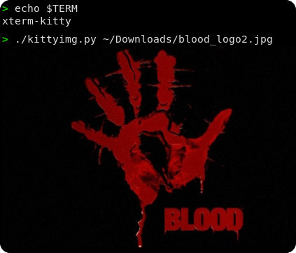

# kittyimg



## Description

`kittyimg` is a simple python implemention of the [Kitty image protocol](https://sw.kovidgoyal.net/kitty/graphics-protocol/?highlight=image+protocol).

Designed with educational purposes, it is limited to just print an image on the screen. No width, height or screen coordinates (X, Y), thouhg adding these features should be a pretty trivial hack.

## Installation

```sh
git clone https://github.com/leo-arch/kittyimg
cd kittyimg
./kittyimg /path/to/image/file
```

## License
GPL-3.0
